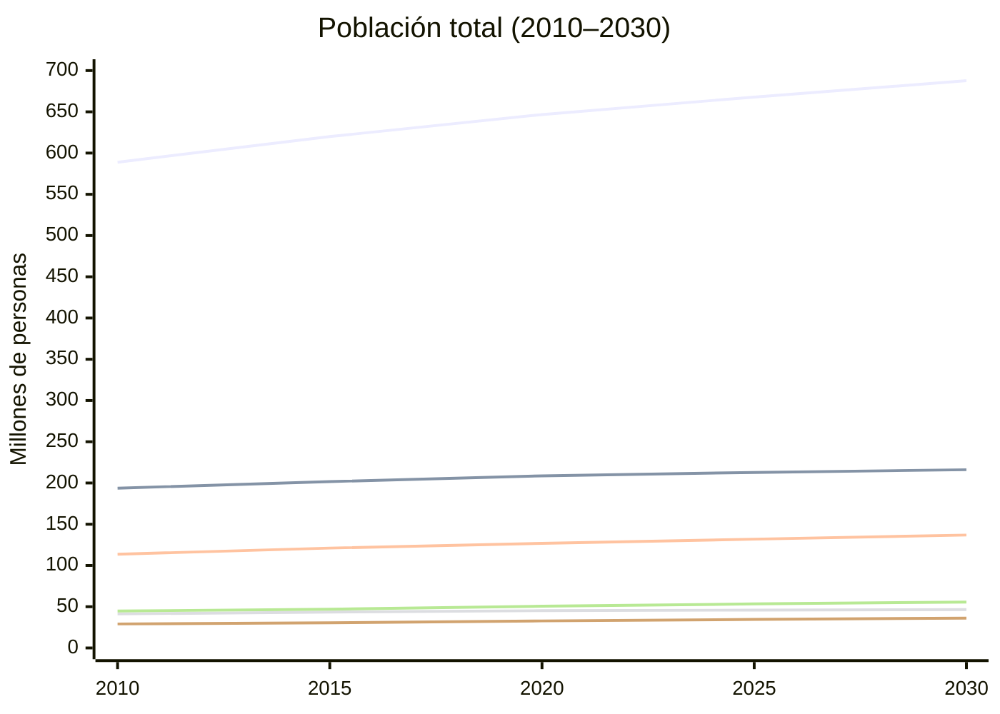
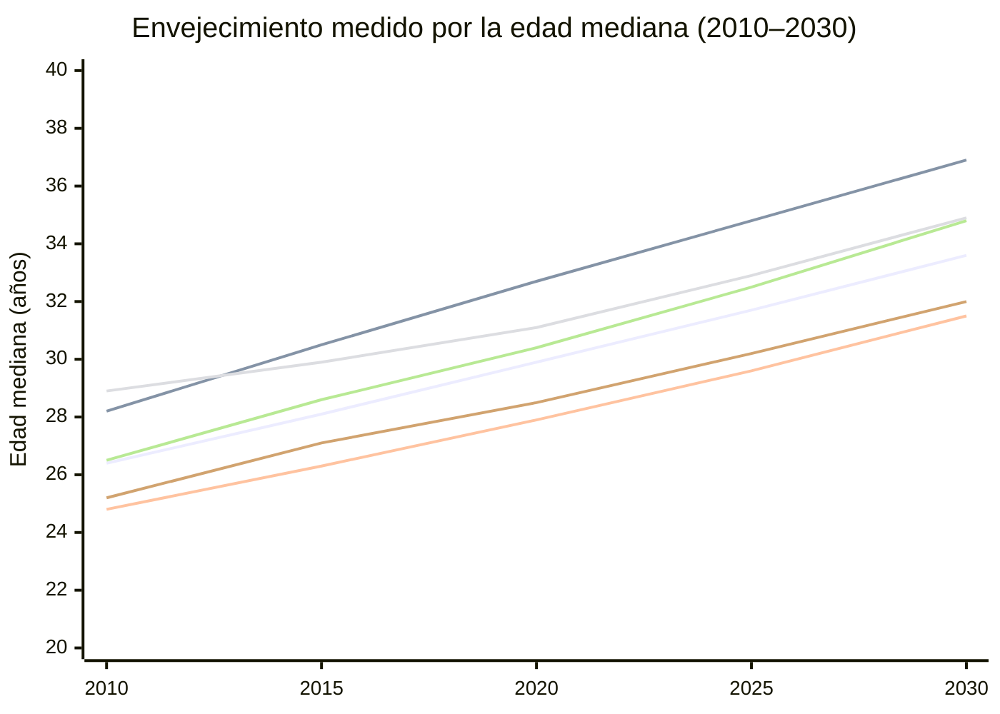

# Tendencias demográficas en hacia 2030

## Resumen ejecutivo

La región se aproxima a 2030 con un perfil demográfico marcado por tres fuerzas simultáneas: (i) menor crecimiento poblacional, (ii) fecundidad persistentemente por debajo del reemplazo en la mayoría de países y (iii) aceleración del envejecimiento, todo ello sobre una base altamente urbanizada. Estas tendencias no son homogéneas: conviven países de envejecimiento rápido (por ejemplo, Brasil) con subregiones aún relativamente jóvenes (Centroamérica), y países receptores netos de migración en el corto plazo (como Colombia) con otros de fuerte emigración histórica (Caribe). citeturn39search6turn39search5turn39search7turn9search21

En el escenario “variante media” de Naciones Unidas, la población de **América Latina y el Caribe** pasa de **588.9 millones (2010)** a **667.9 millones (2025)** y **687.7 millones (2030)**, mientras la tasa de crecimiento anual se reduce aproximadamente a la mitad (de ~1.07% en 2010 a ~0.53% en 2030). citeturn39search6turn39search5

La transición hacia familias más pequeñas es central: la TFR regional cae de **~2.18 (2010)** a **~1.78 (2025)** y **~1.74 (2030)**; diagnósticos regionales recientes ya sitúan la fecundidad consolidada en torno a niveles bajos (≈1.8) y advierten que sostener ritmos de crecimiento pasados será cada vez más difícil. citeturn7search2turn39search6turn39search5

La región envejece con rapidez: la **edad mediana** sube de **~26.4 años (2010)** a **~31.7 (2025)** y **~33.6 (2030)**, con incrementos especialmente rápidos en países grandes como Brasil. citeturn39search6turn39search5

La urbanización parte de niveles altos y tiende a “madurar” más que a expandirse explosivamente: el porcentaje en **“ciudades y pueblos”** (una proxy de “% urbano” bajo el enfoque de grado de urbanización) se mueve alrededor de **~79%** en la región hacia 2025–2030, con variaciones importantes entre países (Perú y Centroamérica por debajo; Argentina por encima). citeturn39search7turn41search12turn41search16

En migración, la región como conjunto sigue con migración neta ligeramente negativa, pero con señales de reconfiguración: Colombia aparece con migración neta positiva en el corto plazo, consistente con flujos intrarregionales extraordinarios (p. ej., desplazamiento venezolano) y con patrones descritos por organismos internacionales de migración y refugio. citeturn7search18turn9search21turn39search6

## Cómo leer la evidencia y los indicadores

Este análisis combina dos fuentes oficiales de Naciones Unidas: entity["book","World Population Prospects 2024","un desa population division 2024"] (WPP) para población total, crecimiento, fecundidad, edad mediana, mortalidad y migración neta; y entity["book","World Urbanization Prospects 2025","un desa population division 2025"] (WUP) para urbanización. Ambas son producidas por el entity["organization","Departamento de Asuntos Económicos y Sociales de las Naciones Unidas","un desa"], y WUP está armonizada para ser consistente con los totales de WPP. citeturn39search6turn39search5turn39search7turn41search16

Los años **2010–2023** corresponden a **estimaciones** (reconstrucciones estadísticas coherentes con censos, registros vitales, encuestas y otros insumos, según disponibilidad por país). A partir de **2024** se presentan **proyecciones** bajo la “variante media” (escenario central) hasta 2100. Por eso, en las tablas se muestra 2025 como **proyección cercana** (no como dato observado). citeturn39search5turn39search6

Para “% urbano” se utiliza el porcentaje de población en **“Cities and Towns”** (ciudades y pueblos) del WUP, un indicador de urbanización según el marco de **grado de urbanización**. Puede diferir del “% urbano” reportado por oficinas nacionales si estas usan definiciones administrativas distintas. citeturn41search12turn39search7

Sobre “% 65+”: el archivo “compact” de indicadores demográficos usado aquí no incluye directamente la proporción de 65+; para construirla, se recomienda combinar WPP con los archivos de población por grupos de edad (o las series de “select age groups”). Por transparencia, las tablas dejan este campo como “—” y se enfatiza la **edad mediana** como proxy robusta del envejecimiento. citeturn39search5turn39search6

## Panorama cuantitativo reciente

### Instantáneas comparables por país y subregión

**Tabla 1. Perfil demográfico (2010, estimaciones).** Fuente: WPP 2024 (variante “Estimates”) y WUP 2025 (“Cities and Towns”) para % urbano. citeturn39search6turn39search5turn41search12turn39search7

| Lugar | Población (M) | Crec. anual (%) | TFR | Edad mediana | % urbano | % 65+ | Migr. neta (‰) |
| --- | --- | --- | --- | --- | --- | --- | --- |
| América Latina y el Caribe | 588.9 | 1.07 | 2.18 | 26.4 | 77.9 | — | -1.51 |
| Centroamérica | 156.8 | 1.47 | 2.46 | 23.7 | 74.7 | — | -1.00 |
| Caribe | 41.4 | 0.48 | 2.33 | 27.8 | 81.7 | — | -3.66 |
| México | 113.6 | 1.42 | 2.34 | 24.8 | 77.2 | — | -0.36 |
| Brasil | 193.7 | 0.82 | 1.79 | 28.2 | 78.3 | — | -1.35 |
| Argentina | 41.3 | 1.06 | 2.41 | 28.9 | 85.2 | — | -0.12 |
| Colombia | 44.8 | 1.11 | 2.01 | 26.5 | 79.1 | — | -0.76 |
| Perú | 29.1 | 0.69 | 2.42 | 25.2 | 70.6 | — | -6.23 |

**Tabla 2. Perfil demográfico (2023, últimas estimaciones disponibles en WPP).** citeturn39search6turn39search5turn41search12turn39search7

| Lugar | Población (M) | Crec. anual (%) | TFR | Edad mediana | % urbano | % 65+ | Migr. neta (‰) |
| --- | --- | --- | --- | --- | --- | --- | --- |
| América Latina y el Caribe | 658.9 | 0.70 | 1.81 | 30.9 | 79.0 | — | -0.56 |
| Centroamérica | 181.6 | 1.00 | 1.99 | 27.8 | 75.2 | — | -0.76 |
| Caribe | 44.2 | 0.46 | 1.98 | 31.7 | 82.5 | — | -1.83 |
| México | 129.7 | 0.88 | 1.91 | 28.9 | 77.5 | — | -0.78 |
| Brasil | 211.1 | 0.41 | 1.62 | 33.9 | 79.5 | — | -1.14 |
| Argentina | 45.5 | 0.35 | 1.50 | 32.1 | 86.2 | — | 0.09 |
| Colombia | 52.3 | 1.10 | 1.65 | 31.6 | 81.9 | — | 2.95 |
| Perú | 33.8 | 1.12 | 1.98 | 29.5 | 73.6 | — | 0.73 |

**Tabla 3. Perfil demográfico (2025, proyección cercana; variante media).** citeturn39search6turn39search5turn41search12turn39search7

| Lugar | Población (M) | Crec. anual (%) | TFR | Edad mediana | % urbano | % 65+ | Migr. neta (‰) |
| --- | --- | --- | --- | --- | --- | --- | --- |
| América Latina y el Caribe | 667.9 | 0.65 | 1.78 | 31.7 | 79.2 | — | -0.61 |
| Centroamérica | 185.2 | 0.93 | 1.95 | 28.5 | 75.4 | — | -0.79 |
| Caribe | 44.6 | 0.38 | 1.95 | 32.4 | 82.7 | — | -2.18 |
| México | 131.9 | 0.81 | 1.87 | 29.6 | 77.5 | — | -0.82 |
| Brasil | 212.8 | 0.37 | 1.60 | 34.8 | 79.7 | — | -1.02 |
| Argentina | 45.9 | 0.34 | 1.50 | 32.9 | 86.3 | — | 0.06 |
| Colombia | 53.4 | 0.98 | 1.62 | 32.5 | 82.2 | — | 2.42 |
| Perú | 34.6 | 1.02 | 1.94 | 30.2 | 74.0 | — | 0.34 |

Una lectura sintética de 2010–2025: la región añade población pero con desaceleración marcada, cae la fecundidad por debajo del reemplazo y la edad mediana aumenta con rapidez; simultáneamente, la urbanización crece poco (porque parte de niveles altos) y la migración neta se vuelve menos negativa a nivel regional, aunque con fuertes diferencias subregionales. citeturn39search6turn39search5turn39search7

### Dos visualizaciones para entender la dirección del cambio



**Figura 1.** La población regional continúa aumentando hacia 2030, pero con pendientes (crecimientos) cada vez menores; la mayor parte del volumen poblacional se concentra en Brasil y México. Fuente: WPP 2024 (estimaciones hasta 2023 y proyecciones, variante media, desde 2024). citeturn39search6turn39search5



**Figura 2.** La edad mediana crece rápidamente en toda la región; Brasil destaca por un ritmo de envejecimiento especialmente acelerado, consistente con su fecundidad baja sostenida. Fuente: WPP 2024 (estimaciones y variante media). citeturn39search6turn39search5

## Tendencias estructurales hacia 2030

La entity["organization","Comisión Económica para América Latina y el Caribe","un regional commission"], a través de su centro demográfico entity["organization","Centro Latinoamericano y Caribeño de Demografía","cepal demography center"], ha subrayado que la región entra a una fase en la que los “vientos a favor” demográficos se debilitan: menos nacimientos, envejecimiento más rápido y menor margen para crecer solo por dinámica poblacional. citeturn7search2turn7search13

**Fecundidad: consolidación de la baja fecundidad.** Entre 2010 y 2025 la TFR regional cae de ~2.18 a ~1.78, y hacia 2030 se ubica en ~1.74. Este patrón es coherente con la evidencia de transición demográfica avanzada y con investigación reciente que documenta cambios rápidos en preferencias y calendarios reproductivos, crecientes costos de crianza en contextos urbanos, y barreras de conciliación trabajo–familia. citeturn39search6turn39search5turn7search9turn7search7

**Mortalidad: recuperación tras el shock pandémico, con desigualdad.** En la última década y media, la longevidad regional mejora en promedio, pero la pandemia introdujo retrocesos temporales en varios países. En los datos de WPP, por ejemplo, México muestra una caída notable de la esperanza de vida alrededor de 2020, seguida de recuperación hacia 2023; esta trayectoria es consistente con análisis regionales sobre el impacto sanitario de COVID-19 en América Latina y el Caribe. citeturn39search6turn39search5turn7search16turn7search14

**Migración: de “válvula demográfica” a variable macroterritorial.** En la región, la migración neta agregada sigue siendo levemente negativa hacia 2030 (Tabla 4), pero aumenta la heterogeneidad: países con entradas netas (receptores) coexisten con corredores de salida persistentes. Los grandes desplazamientos intrarregionales —en particular el caso venezolano— han reconfigurado balances migratorios de países receptores (como Colombia y, en ciertos años, Perú) y presionan servicios urbanos, mercados laborales e integración social. citeturn7search18turn9search21turn39search6

**Urbanización: alta, pero con nuevas demandas.** La región ya es predominantemente urbana y hacia 2030 el porcentaje urbano crece lentamente (en torno a 79–80% para el agregado regional). El desafío pasa menos por “urbanizar” y más por **gestionar calidad urbana**: housing asequible, transporte público, densificación con servicios, reducción de riesgos climáticos y provisión de cuidados en ciudades envejecidas. citeturn39search7turn41search12turn41search16

**Envejecimiento y “declive del bono juvenil”.** Con fecundidad baja, la estructura por edades se desplaza: las cohortes jóvenes crecen poco o se estabilizan, mientras aumentan los grupos de mayor edad. Esto estrecha la ventana del bono demográfico y eleva la relevancia de productividad, formalidad y participación laboral femenina y de personas mayores, temas explícitamente discutidos en la agenda regional de población y desarrollo. citeturn7search13turn39search6

## Diferencias subregionales y por país

En lo que sigue se destacan: entity["country","México","country in north america"], entity["country","Brasil","country in south america"], entity["country","Argentina","country in south america"], entity["country","Colombia","country in south america"], entity["country","Perú","country in south america"], además de entity["place","Centroamérica","region in the americas"] y el entity["place","Caribe","region in the americas"]. citeturn39search6turn39search7

**Tabla 4. Perfil demográfico hacia 2030 (variante media).** citeturn39search6turn39search5turn41search12turn39search7

| Lugar | Población (M) | Crec. anual (%) | TFR | Edad mediana | % urbano | % 65+ | Migr. neta (‰) |
| --- | --- | --- | --- | --- | --- | --- | --- |
| América Latina y el Caribe | 687.7 | 0.53 | 1.74 | 33.6 | 79.6 | — | -0.53 |
| Centroamérica | 193.3 | 0.80 | 1.87 | 30.3 | 75.9 | — | -0.74 |
| Caribe | 45.3 | 0.25 | 1.90 | 34.0 | 83.1 | — | -2.19 |
| México | 136.9 | 0.67 | 1.79 | 31.5 | 77.9 | — | -0.78 |
| Brasil | 216.1 | 0.25 | 1.58 | 36.9 | 80.1 | — | -0.68 |
| Argentina | 46.6 | 0.30 | 1.51 | 34.9 | 86.6 | — | 0.02 |
| Colombia | 55.7 | 0.72 | 1.58 | 34.8 | 82.9 | — | 1.52 |
| Perú | 36.2 | 0.83 | 1.87 | 32.0 | 74.9 | — | -0.12 |

image_group{"layout":"carousel","aspect_ratio":"16:9","query":["mapa América Latina y el Caribe","pirámide poblacional América Latina y el Caribe","urbanización en América Latina ciudades","Caribbean island city skyline"],"num_per_query":1}

**México.** Hacia 2030 mantiene crecimiento moderado (~0.67% anual) con fecundidad ya baja (~1.79). La migración neta es negativa (salidas netas), lo cual puede acelerar el envejecimiento relativo en algunas zonas de origen y reforzar la concentración urbana y metropolitana. citeturn39search6turn39search5turn9search21

**Brasil.** Es el caso emblemático de envejecimiento rápido: edad mediana ~36.9 hacia 2030 y crecimiento anual bajo (~0.25%). Una fecundidad persistentemente baja desde hace años (ya ~1.79 en 2010 y ~1.60 en 2025) explica el cambio estructural. El principal reto pasa por productividad, reformas de protección social y sistema de cuidados. citeturn39search6turn39search5turn9search11

**Argentina.** Combina urbanización muy alta (≈86% hacia 2030, en la métrica “ciudades y pueblos”), crecimiento bajo (~0.30) y fecundidad baja (~1.51). Su migración neta aparece cercana a cero o levemente positiva, lo que sugiere que los efectos del envejecimiento dependerán más de fecundidad y mortalidad que de entradas/salidas netas. citeturn39search6turn39search7

**Colombia.** Destaca por migración neta positiva en el corto plazo y aún hacia 2030 (~1.52‰), coherente con un rol receptor intrarregional. Esto puede aumentar población y rejuvenecer parcialmente algunas estructuras urbanas, pero exige políticas de integración, mercado laboral y servicios en ciudades receptoras. citeturn7search18turn9search21turn39search6

**Perú.** Presenta transición rápida: fuerte emigración neta en 2010 (–6.23‰) y valores cercanos a cero hacia 2030. La edad mediana sube (~32.0 en 2030) y la urbanización se mantiene por debajo del promedio regional. Esto puede traducirse en “doble agenda”: cerrar brechas de servicios en territorios menos urbanizados y, simultáneamente, prepararse para envejecimiento y cuidados. citeturn39search6turn39search7turn9search21

**Centroamérica.** Mantiene una edad mediana más baja (≈30.3 en 2030), con crecimiento aún relativamente alto (~0.80), pero con migración neta negativa persistente. La combinación “juventud relativa + emigración” puede tensionar mercados laborales y sistemas educativos, y al mismo tiempo reducir el tejido productivo local si la salida se concentra en edades activas. citeturn39search6turn9search21

**Caribe.** Se caracteriza por crecimiento bajo y emigración neta elevada (≈–2.19‰ hacia 2030), con edad mediana alta (≈34.0). En economías pequeñas, la emigración selectiva (jóvenes y calificados) puede amplificar el envejecimiento, además de afectar disponibilidad de personal sanitario y docente. citeturn39search6turn9search15turn9search21

## Impulsores y implicaciones de política pública

La convergencia hacia baja fecundidad, urbanización alta y envejecimiento acelerado responde a impulsores estructurales: expansión educativa femenina, mayor acceso a anticoncepción, cambios en normas familiares, incremento del costo de vivienda y crianza en ciudades, y mercados laborales con alta informalidad que elevan el “costo de oportunidad” de la maternidad. Parte de esta dinámica está documentada tanto en evidencia regional como en estudios recientes sobre caídas de fecundidad más rápidas de lo previsto. citeturn7search2turn7search9turn7search7

En mortalidad, la región tiende a ganancias de longevidad, pero los choques (pandemias, violencia, crisis sanitarias) pueden crear retrocesos temporales y desigualdades entre países y dentro de los países. El ciclo COVID-19 mostró la capacidad de interrumpir tendencias de largo plazo, con implicaciones directas sobre “envejecimiento efectivo” (más años de vida, pero también más necesidad de salud y cuidados). citeturn7search16turn39search5turn39search6

En migración, los factores de expulsión y atracción (violencia, crisis económicas, salarios relativos, redes, desastres y clima) y los cambios regulatorios influyen en la magnitud y dirección de flujos. La evidencia regional reciente subraya el peso creciente de migración intrarregional y desplazamientos forzados, con impactos concentrados territorialmente. citeturn9search21turn7search18

En términos de política pública, hacia 2030 aparecen cinco frentes prioritarios:

**Mercados laborales y productividad.** Con menor crecimiento de la población en edad de trabajar, el crecimiento económico dependerá más de productividad, formalización, adopción tecnológica y aumento de participación laboral (mujeres y mayores). Esto refuerza la necesidad de políticas activas de empleo y de transición escuela–trabajo en países aún jóvenes. citeturn7search13turn9search11

**Pensiones y sostenibilidad fiscal.** El envejecimiento eleva la relación de dependencia y presiona sistemas contributivos con alta informalidad. La región enfrenta el doble desafío de ampliar cobertura y asegurar sostenibilidad (paramétrica y/o estructural), con atención a equidad intergeneracional. citeturn9search11turn39search6

**Salud y cuidados de larga duración.** Más edades avanzadas implican mayor carga de enfermedades crónicas, demanda de cuidados y necesidad de integrar salud–social. Países con envejecimiento rápido (Brasil, Argentina, Caribe) requieren planificar servicios geriátricos, cuidados comunitarios y apoyo a cuidadores. citeturn9search15turn39search6

**Educación: del “volumen” a la “calidad” (y a la movilidad social).** A medida que caen nacimientos, algunos países podrían reasignar recursos para mejorar calidad educativa (infraestructura, docentes, permanencia) si existe capacidad fiscal e institucional. Pero la emigración juvenil en ciertas subregiones puede tensionar la planificación escolar y la retención de talento. citeturn7search13turn9search21

**Planificación urbana y territorial.** Con urbanización alta, los retos pasan por vivienda, transporte, resiliencia climática, servicios básicos y gobernanza metropolitana. La migración interna e internacional tiende a concentrarse en ciudades receptoras, por lo que la coordinación intergubernamental y la financiación urbana se vuelven críticas. citeturn39search7turn41search12turn9search21

## Incertidumbres y escenarios

Las proyecciones a 2030 son relativamente cercanas en el tiempo, pero siguen sujetas a incertidumbre. El propio marco metodológico de WPP combina proyecciones deterministas (variantes alta/media/baja) con enfoques probabilísticos para cuantificar rangos plausibles; la incertidumbre suele ser mayor en migración que en mortalidad a corto plazo, y mayor en fecundidad a horizontes largos. citeturn39search5turn39search6

En fecundidad, escenarios “alto/bajo” pueden modificar significativamente el ritmo de envejecimiento y la velocidad a la que se reduce el crecimiento. Esto es crucial en países donde la fecundidad ya es muy baja: pequeños cambios sostenidos alteran la estructura por edades más que el tamaño total a corto plazo. citeturn39search5turn39search6turn7search9

En migración, pueden ocurrir “shocks” por crisis políticas, colapsos económicos, violencia o eventos climáticos. En América Latina y el Caribe, la experiencia reciente del desplazamiento venezolano muestra cómo un shock puede redefinir, en pocos años, la demografía urbana y los indicadores de migración neta de los países receptores. citeturn7search18turn9search21

En mortalidad, la incertidumbre se relaciona con la recuperación postpandemia, la capacidad de los sistemas de salud, la prevención de enfermedades no transmisibles, y riesgos emergentes (nuevas epidemias, olas de calor, contaminación). En el corto plazo, estas variables pueden afectar esperanza de vida y la “carga” del envejecimiento (años vividos con discapacidad). citeturn7search16turn39search5

```mermaid
flowchart LR
  A[Fecundidad a la baja] --> B[Menos nacimientos]
  B --> C[Menor crecimiento poblacional]
  C --> D[Envejecimiento acelerado]
  D --> E[Más presión en pensiones y salud]
  C --> F[Ventana del bono demográfico se estrecha]
  F --> G[Prioridad a productividad y empleo formal]
  A --> H[Hogares más pequeños]
  H --> I[Demanda de vivienda, cuidados y servicios cambia]
  J[Choques migratorios
(crisis, violencia, clima)] --> K[Reasignación territorial]
  K --> L[Presión sobre ciudades receptoras]
  L --> M[Política migratoria + integración]
```

**Figura 3.** Mapa lógico (no predictivo) de cómo las tendencias demográficas se traducen en demandas de política pública; los “choques” migratorios pueden alterar trayectorias territoriales incluso si no cambian drásticamente el tamaño total poblacional. citeturn39search5turn9search21turn7search18

## Fuentes de datos y referencias priorizadas

**Prioridad máxima (oficiales y comparables regionalmente).**  
La base recomendada para cualquier blog, informe o nota de política es combinar WPP (población, fecundidad, mortalidad, migración) con WUP (urbanización), y usar las publicaciones metodológicas para interpretar supuestos y escenarios. citeturn39search6turn39search5turn39search7turn41search12

**Prioridad alta (enfoque regional y diagnóstico de política).**  
Las notas y estudios de CEPAL/CELADE son particularmente útiles para traducir la transición demográfica a implicaciones macro (bono demográfico, envejecimiento, planificación y desigualdad). citeturn7search2turn7search13

**Prioridad alta (marcos socioeconómicos y sostenibilidad de sistemas).**  
Series e informes del Banco Mundial sobre envejecimiento, sistemas de pensiones y presión fiscal ayudan a convertir la demografía en “agenda de reformas” aplicable. citeturn9search11

**Prioridad alta (migración y desplazamiento).**  
Para migración intrarregional y shocks, combinar el reporte internacional de migración de OIM con estadísticas de ACNUR/R4V en desplazamientos forzados. citeturn9search21turn7search18

**Oficinas nacionales de estadística (para desagregación territorial y validación local).**  
Para profundizar por estados/provincias, áreas metropolitanas, desigualdades y cohortes, priorizar: entity["organization","Instituto Nacional de Estadística y Geografía","mexico stats office"], entity["organization","Instituto Brasileiro de Geografia e Estatística","brazil stats office"], entity["organization","Instituto Nacional de Estadística y Censos","argentina stats office"], entity["organization","Departamento Administrativo Nacional de Estadística","colombia stats office"] y entity["organization","Instituto Nacional de Estadística e Informática","peru stats office"]. citeturn55search16

**Referencias académicas recientes (para interpretar cambios acelerados).**  
Para contextualizar por qué la fecundidad cae más rápido de lo que asumen “relatos” tradicionales (y cómo inciden desigualdad, aspiraciones y calendarios reproductivos), son útiles artículos académicos recientes y documentos de trabajo especializados sobre la región. citeturn7search9turn7search7

**Nota técnica sobre el indicador “% 65+”.**  
Si tu publicación necesita obligatoriamente el porcentaje 65+ en una tabla (por ejemplo, para estimar demanda de cuidados o presión en pensiones), la ruta recomendada es derivarlo desde los archivos WPP de población por edades o “select age groups” (no incluidos en el “compact” de indicadores), manteniendo coherencia con la variante (estimaciones vs proyección media). La metodología general de WPP describe con detalle el andamiaje de estimación y proyección por edad y sexo que permite ese cálculo. citeturn39search5turn39search6